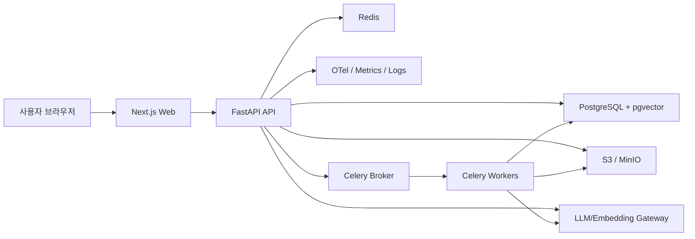

# RockASK 대시보드 개발 명세서

버전: `v1.0`  
기준일: `2026-03-11`  
대상 화면: [rag_landing_refined.html](/D:/myhome/JJ-RAG-Platform/rag_landing_refined.html)

이 문서는 현재 화면을 실제 서비스로 구현하기 위한 개발용 명세서입니다. 스택 선택은 최신 공식 문서 기준으로 버전을 확인했고, 전체 조합과 아키텍처는 그 위에 얹은 설계 판단입니다.

## 1. 제품 목표

- 로그인 직후 사용자가 10초 이내에 첫 질문을 시작할 수 있어야 한다.
- 사용자가 `내 권한 범위`, `데이터 최신성`, `출처 제공 여부`를 첫 화면에서 이해할 수 있어야 한다.
- 최근 채팅, 지식 공간, 추천 프롬프트를 통해 반복 업무를 재개할 수 있어야 한다.
- 운영자는 첫 화면만 보고도 색인 상태, 실패 건수, 최근 반영 상태를 확인할 수 있어야 한다.

## 2. 권장 기술 스택

| 영역 | 권장 스택 | 선택 이유 |
|---|---|---|
| Web App | `Next.js 16` + `React 19.2` + `TypeScript 5.9` | 내부 업무 앱이어도 권한 기반 SSR, 라우팅, 서버 연동, 배포 구조가 안정적임 |
| UI | `Tailwind CSS 4.x` | 현재 시안과 잘 맞고 빠르게 컴포넌트화 가능 |
| 서버 API | `Python 3.13.x` + `FastAPI 0.126+` + `Uvicorn` | RAG/AI 생태계와 궁합이 가장 좋고, 문서 업로드/검색 API 구성에 적합 |
| 설정/검증 | `Pydantic 2.11+` + `pydantic-settings` | 요청/응답 스키마, 환경변수 관리 표준화 |
| DB/ORM | `PostgreSQL 18` + `SQLAlchemy 2.0` + `Alembic` | 메타데이터, ACL, 채팅, 피드백, 운영 로그를 한 DB에 수용 가능 |
| 벡터 검색 | `pgvector 0.8.1` | Postgres 안에서 벡터 검색과 ACL 필터를 함께 처리 가능 |
| 캐시/브로커 | `Redis 8` | 캐시, 세션성 상태, rate limit, 작업 브로커 용도 |
| 비동기 작업 | `Celery 5.6` | 업로드, OCR, 청킹, 임베딩, 색인, 집계 작업 분리에 적합 |
| 파일 저장소 | `S3 호환 스토리지` 또는 `MinIO/AIStor` | 원본 문서, 썸네일, OCR 산출물 보관 |
| 검색 확장 | `PostgreSQL FTS` 우선, 대규모 시 `OpenSearch 3.x` 추가 | 현재 화면 범위와 사내 문서 규모라면 초기엔 Postgres만으로 충분함 |
| 관측성 | `OpenTelemetry` + `Prometheus` + `Grafana` + `Loki` | 질의 성능, 워커 실패, 색인 지연 추적 |
| 인증 | 사내 `OIDC/OAuth2` SSO | Entra ID, Okta, Keycloak 등과 표준 연동 가능 |
| 패키지 관리 | `uv` | Python 의존성/가상환경/lockfile 관리가 단순하고 빠름 |

### 권장 버전 정책

- `Python 3.14.3`가 2026-03-11 기준 최신 기능 릴리스이지만, 이 문서는 기업 운영 안정성을 고려해 기본 런타임을 `Python 3.13.x`로 권장합니다.
- 이 판단은 Python 공식 릴리스 현황을 바탕으로 한 운영 안정성 우선의 설계 추론입니다.
- 프론트는 신규 구축이므로 `Next.js 16`, `React 19.2`, `Tailwind 4.x`, `TypeScript 5.9`를 바로 채택합니다.

## 3. 권장 아키텍처



## 4. 시스템 구성 원칙

- 웹 앱과 RAG 도메인 API는 분리한다.
- 웹은 화면 렌더링과 사용자 상호작용에 집중하고, 검색/업로드/색인/권한 로직은 FastAPI가 담당한다.
- 검색은 `키워드 + 벡터` 하이브리드로 시작한다.
- ACL은 검색 후 필터링이 아니라 검색 쿼리 단계에서 적용한다.
- 첫 화면 데이터는 여러 API를 브라우저가 따로 호출하지 말고, `Dashboard Aggregation API`로 묶어 준다.
- 긴 작업은 반드시 비동기 워커로 넘긴다.

## 5. 서비스 모듈

- `web-app`: 대시보드, 검색 시작, 최근 채팅, 지식 공간, 알림 UI
- `api-gateway`: 인증 컨텍스트, 사용자 정보, 대시보드 응답 조립
- `query-service`: 질의 생성, 검색 범위 적용, 검색 실행, 답변 생성
- `retrieval-service`: FTS 검색, pgvector 검색, rerank, citation 조합
- `ingestion-service`: 업로드 등록, 파싱, OCR, 청킹, 임베딩, 색인
- `acl-service`: 사용자/팀/지식공간/문서 권한 판정
- `feedback-service`: 오답 신고, 품질 이슈 접수, 처리 상태 관리
- `analytics-service`: KPI 집계, 검색 사용량, 피드백 처리율 산출

## 6. 현재 화면과 백엔드 매핑

| 화면 영역 | 백엔드 데이터 소스 | 설명 |
|---|---|---|
| 상단 검색창 | `query-service` | 어디서든 새 질의 시작 |
| 권한 배지 | `acl-service` | 사용자 접근 정책 표시 |
| 범위 칩 | `dashboard/scopes` | 전사, 팀, 개인 범위 |
| Data Health | `dashboard/health` | 동기화 시각, 색인 대기, 실패 수 |
| 즉시 실행 | 정적 + 권한 | 업로드/컬렉션관리 버튼 노출 제어 |
| KPI 카드 | `dashboard/summary` | 문서 수, 질의 수, 평균 응답 시간 |
| 주요 지식 공간 | `dashboard/knowledge-spaces` | 문서 수, 상태, 담당자 |
| 최근 업데이트 | `dashboard/recent-updates` | 최신 반영 문서 |
| 추천 프롬프트 | `dashboard/recommended-prompts` | 부서/역할 기반 |
| 최근 채팅 | `dashboard/recent-chats` | 사용자 세션 목록 |

## 7. API 설계

`GET /api/v1/me`
- 반환: `user_id`, `name`, `team`, `roles`, `theme`, `available_scopes`

`GET /api/v1/dashboard`
- 첫 화면 렌더링용 집계 API
- 반환: `profile`, `health`, `summary`, `scopes`, `knowledge_spaces`, `recent_updates`, `recommended_prompts`, `recent_chats`, `alerts`

`POST /api/v1/queries`
- 입력: `query`, `scope_id`, `source=dashboard`, `prompt_template_id?`
- 반환: `query_id`, `chat_id`, `redirect_url`

`GET /api/v1/chats`
- 최근 채팅 전체 목록 조회

`GET /api/v1/chats/{chat_id}`
- 대화 이력과 citation 포함 조회

`POST /api/v1/documents`
- 문서 업로드 등록
- 입력: 파일 메타데이터, 소속 지식공간, 권한 정책, 태그

`GET /api/v1/knowledge-spaces`
- 접근 가능한 지식공간 목록

`GET /api/v1/dashboard/health`
- 동기화 상태 카드 단독 갱신용

`POST /api/v1/feedback`
- 입력: `chat_id`, `message_id`, `type`, `reason`, `details`

`PATCH /api/v1/preferences`
- `theme`, `last_scope_id` 등 저장
## 8. `GET /api/v1/dashboard` 응답 예시

```json
{
  "profile": {
    "name": "김개발",
    "team": "플랫폼개발팀"
  },
  "health": {
    "status": "healthy",
    "last_sync_at": "2026-03-11T10:15:00+09:00",
    "indexed_today": 148,
    "pending_index_jobs": 12,
    "failed_ingestion_jobs": 1,
    "citation_policy": "always_on"
  },
  "summary": {
    "searchable_documents": 24860,
    "queries_today": 1284,
    "avg_response_time_ms": 6200,
    "feedback_resolution_rate_7d": 0.94
  },
  "scopes": [
    {"id":"global","label":"전사 검색","enabled":true,"is_default":true},
    {"id":"eng","label":"개발 문서","enabled":true,"is_default":false}
  ],
  "knowledge_spaces": [],
  "recent_updates": [],
  "recommended_prompts": [],
  "recent_chats": []
}
```

## 9. 데이터 모델

| 테이블 | 핵심 컬럼 |
|---|---|
| `users` | `id`, `employee_no`, `name`, `email`, `team_id`, `status` |
| `teams` | `id`, `name`, `parent_team_id` |
| `roles` | `id`, `code`, `name` |
| `user_roles` | `user_id`, `role_id` |
| `knowledge_spaces` | `id`, `name`, `owner_team_id`, `status`, `contact_user_id` |
| `documents` | `id`, `knowledge_space_id`, `title`, `source_type`, `current_version_id`, `visibility` |
| `document_versions` | `id`, `document_id`, `storage_key`, `checksum`, `updated_at`, `parser_status` |
| `document_chunks` | `id`, `document_version_id`, `chunk_index`, `content`, `token_count`, `metadata_json` |
| `document_embeddings` | `chunk_id`, `embedding vector(n)` |
| `acl_entries` | `resource_type`, `resource_id`, `subject_type`, `subject_id`, `permission` |
| `chats` | `id`, `user_id`, `title`, `scope_id`, `created_at`, `last_message_at` |
| `messages` | `id`, `chat_id`, `role`, `content`, `model`, `created_at` |
| `citations` | `id`, `message_id`, `document_id`, `document_version_id`, `chunk_id`, `score` |
| `ingestion_jobs` | `id`, `document_id`, `job_type`, `status`, `attempt`, `error_message` |
| `feedback_items` | `id`, `chat_id`, `message_id`, `type`, `status`, `created_by` |
| `prompt_templates` | `id`, `title`, `prompt_text`, `team_id`, `role_filter` |
| `dashboard_metric_snapshots` | `metric_key`, `metric_value`, `captured_at` |

## 10. 검색 설계

- 1차 검색은 `PostgreSQL FTS(BM25 유사 역할)` + `pgvector` 하이브리드로 구현한다.
- 후보 문서를 합친 뒤 ACL을 적용하는 것이 아니라, 각 검색 쿼리 자체에 ACL 조건을 포함한다.
- 상위 후보 청크를 rerank한 후 답변 생성 단계로 넘긴다.
- 답변은 반드시 citation을 포함한다.
- citation에는 `문서명`, `버전`, `업데이트 시각`, `지식공간`, `권한 범위`를 포함한다.
- `최근 업데이트`, `주요 지식 공간`, `추천 프롬프트`는 검색 인프라와 별도 캐시 레이어를 둔다.

## 11. 문서 수집/색인 파이프라인

1. 사용자가 문서를 업로드하거나 외부 소스 동기화를 등록한다.
2. 원본 파일을 S3 계열 스토리지에 저장한다.
3. 파서가 파일 형식별로 텍스트를 추출한다.
4. 필요 시 OCR을 수행한다.
5. 텍스트를 청킹한다.
6. 청크별 메타데이터와 ACL을 부여한다.
7. 임베딩을 생성한다.
8. Postgres와 pgvector에 색인한다.
9. KPI와 health 집계를 갱신한다.
10. 실패 시 `ingestion_jobs`에 원인을 남기고 재시도한다.

## 12. 권한/보안 설계

- 인증은 사내 SSO 기반 `OIDC/OAuth2`를 사용한다.
- 사용자 정보와 그룹/부서 정보는 토큰 클레임 또는 IAM sync로 가져온다.
- 검색 범위 칩은 사용자가 접근 가능한 범위만 내려준다.
- `최근 업데이트`, `지식 공간`, `최근 채팅`은 모두 사용자 ACL 기준으로 필터링한다.
- 관리자용 수집 상태와 일반 사용자용 화면 데이터는 응답을 분리한다.
- 업로드 파일은 바이러스 스캔과 MIME 검증을 통과해야 한다.
- 민감 문서는 마스킹 전처리 정책을 둘 수 있어야 한다.
- 감사 로그는 `누가`, `어떤 문서`, `어떤 질의`, `언제 접근했는지`를 남겨야 한다.
## 13. 비기능 요구사항

- 첫 화면 `LCP 2.5초` 이내 목표
- `GET /dashboard` p95 `500ms` 이내 목표
- `POST /queries` 초기 응답 p95 `800ms` 이내 목표
- 최종 답변 완료 p95 `8초` 이내 목표
- 문서 업로드 후 검색 가능 상태 진입은 일반 문서 기준 `5분` 이내 목표
- 대시보드는 부분 실패를 허용해야 한다.
- 워커 실패는 자동 재시도 3회 후 dead-letter 처리한다.

## 14. 관측성

- 모든 요청에 `request_id`, `user_id`, `chat_id`, `scope_id`를 로그에 남긴다.
- 추적 단위는 `dashboard_load`, `query_run`, `ingestion_job`, `embedding_call`, `rerank_call`, `generation_call`로 나눈다.
- 핵심 지표는 `dashboard_latency`, `query_latency`, `retrieval_recall_proxy`, `ingestion_success_rate`, `citation_click_rate`, `feedback_rate`다.
- 알람 조건은 `last_sync_delay > 30m`, `failed_ingestion_jobs > threshold`, `query_error_rate > threshold`다.

## 15. 프론트 구현 원칙

- 페이지 라우팅은 App Router 기준으로 설계한다.
- 서버 컴포넌트로 초기 대시보드 데이터를 가져오고, 클라이언트 컴포넌트는 검색 입력, 범위 칩, 다크모드 토글, 알림 드롭다운에 한정한다.
- 데이터 갱신은 TanStack Query로 처리한다.
- 공통 UI는 `Card`, `MetricCard`, `PromptChip`, `KnowledgeSpaceCard`, `RecentChatItem` 단위로 분리한다.
- 다크모드는 사용자 설정 API와 `localStorage`를 함께 사용해 즉시 반영한다.

## 16. 권장 디렉터리 구조

```text
/apps
  /web                 # Next.js
  /api                 # FastAPI
/packages
  /ui                  # 공통 디자인 시스템
  /types               # TS 타입
  /config              # 공통 설정
/services
  /workers             # Celery tasks
  /parsers             # 파일 파서/OCR
  /embeddings          # 임베딩 어댑터
  /rerankers           # 리랭커 어댑터
/infrastructure
  /docker
  /k8s
  /terraform
```

## 17. 구현 우선순위

1. P0: 로그인, 대시보드 집계 API, 검색 시작, 최근 채팅, 지식 공간, health 카드
2. P1: 문서 업로드, 수집 파이프라인, 추천 프롬프트, 오답 신고
3. P2: 알림 센터, 관리자용 수집 대시보드, 개인화 추천
4. P3: OpenSearch 확장, 고급 rerank, 부서별 운영 리포트

## 18. MVP 범위

- `전사 검색`, `개발 문서`, `내 문서만` 3개 범위
- 수동 업로드 + 기본 파일 파싱
- Postgres FTS + pgvector 하이브리드 검색
- citation 포함 답변
- 최근 채팅, 최근 업데이트, 주요 지식 공간
- 기본 오답 신고
- 관리자용 간단한 health 지표

## 19. 제외 범위

- 음성 입력
- 실시간 공동 편집
- 에이전트 자동 실행 워크플로우
- 대규모 OpenSearch 분산 클러스터
- 복잡한 승인 워크플로우

## 20. 개발 리스크

- ACL을 후처리로 두면 검색 품질과 보안이 동시에 깨질 수 있다.
- OCR 품질이 낮으면 citation 신뢰도가 떨어진다.
- 문서 버전 관리가 약하면 “최신성” 지표가 의미 없어진다.
- 대시보드 집계를 실시간 계산으로만 하면 응답 지연이 커진다.
- OpenSearch를 너무 일찍 도입하면 운영 복잡도만 증가할 수 있다.
## 21. 최종 권장안

- 초기 운영은 `Next.js + FastAPI + PostgreSQL/pgvector + Redis + Celery + S3/MinIO`로 시작한다.
- 검색은 `Postgres FTS + pgvector` 하이브리드로 시작하고, 문서 청크 수와 검색 부하가 크게 증가할 때만 OpenSearch를 추가한다.
- 이 판단은 공식 기술 문서가 제시하는 기능 범위와 현재 화면 요구사항을 합친 설계 추론이다.

## 22. 참고 링크

- [Next.js 16](https://nextjs.org/blog/next-16)
- [React 19.2](https://react.dev/blog/2025/10/01/react-19-2)
- [Tailwind CSS v4](https://tailwindcss.com/blog/tailwindcss-v4)
- [TypeScript 5.9](https://www.typescriptlang.org/docs/handbook/release-notes/typescript-5-9.html)
- [Python 릴리스 현황](https://www.python.org/downloads/)
- [Python 3.14.3](https://www.python.org/downloads/latest/python3.14/)
- [Python 3.13.12](https://www.python.org/downloads/latest/python3.13/)
- [FastAPI release notes](https://fastapi.tiangolo.com/release-notes/)
- [SQLAlchemy 2.0 docs](https://docs.sqlalchemy.org/20/)
- [PostgreSQL current docs](https://www.postgresql.org/docs/)
- [pgvector](https://github.com/pgvector/pgvector)
- [Redis 8](https://redis.io/docs/latest/develop/whats-new/8-0/)
- [Celery 5.6](https://docs.celeryq.dev/en/stable/userguide/)
- [uv docs](https://docs.astral.sh/uv/)
