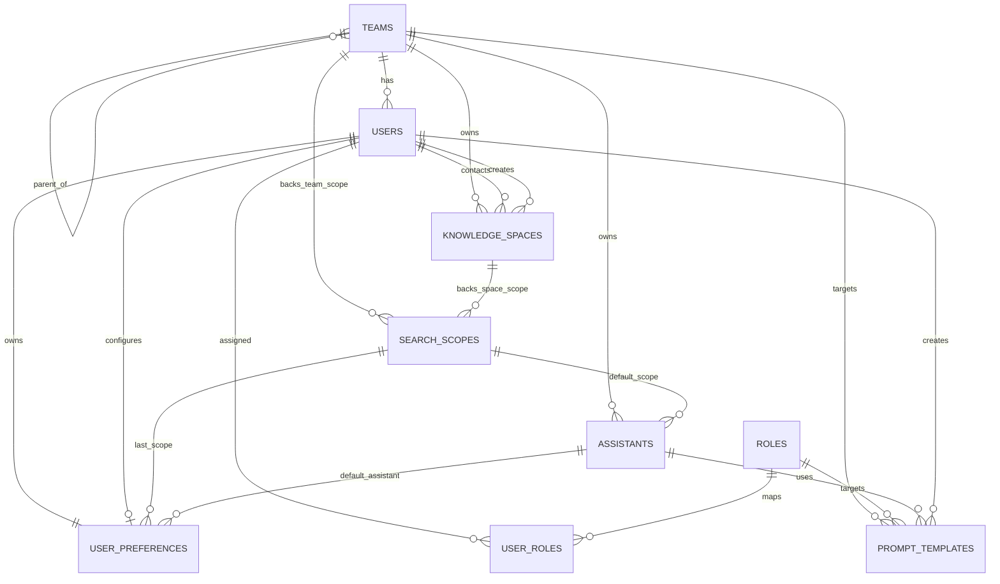
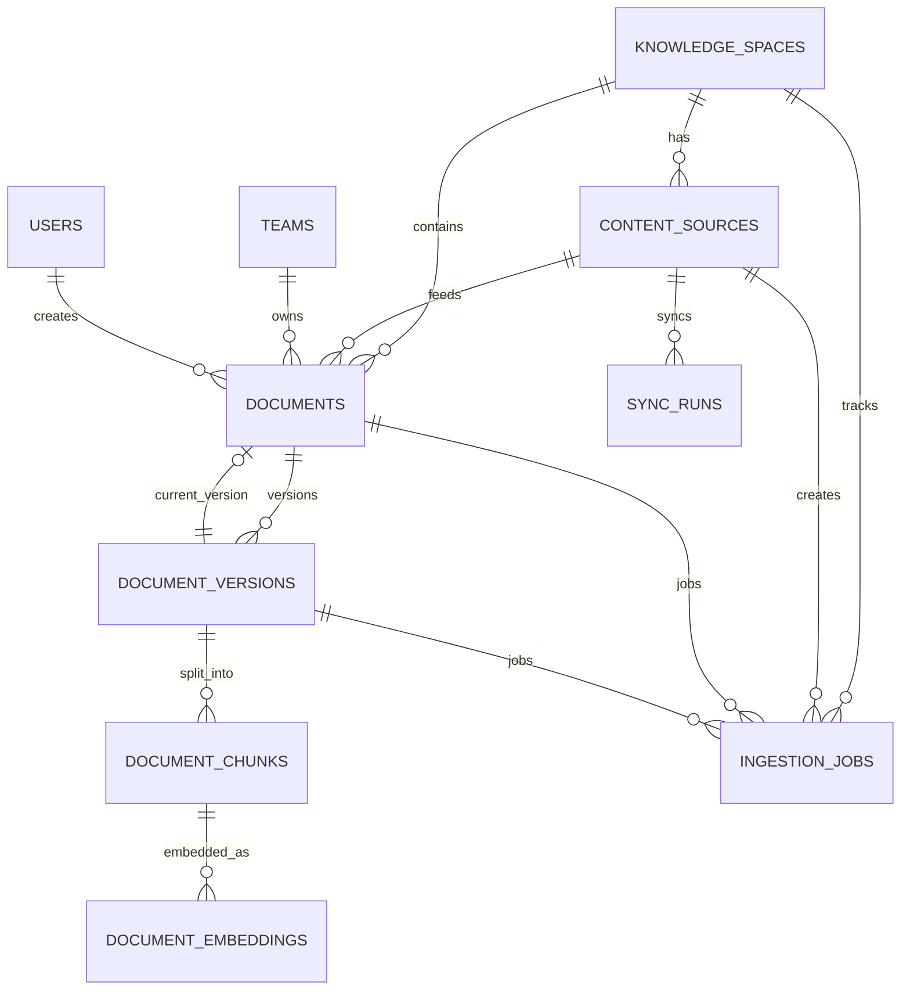
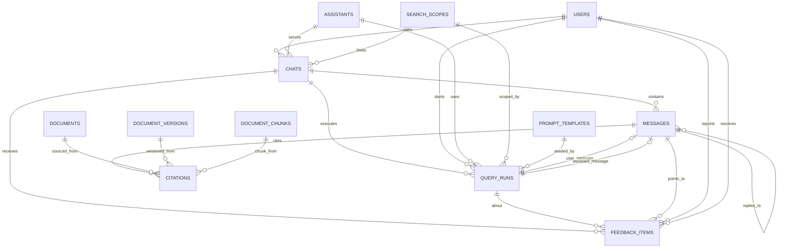
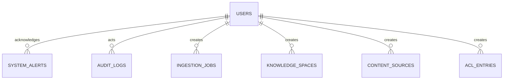

# RockASK ERD 문서

기준 스키마: [schema.sql](/D:/myhome/JJ-RAG-Platform/db/schema.sql)  
작성일: `2026-03-11`

이 문서는 `rockask` PostgreSQL 스키마의 엔티티 관계를 사람이 읽기 쉬운 형태로 정리한 ERD 문서다.  
전체 스키마는 대시보드, 검색, 문서 수집, RAG 검색, 채팅, 피드백, 운영 모니터링까지 포함하므로 하나의 거대한 ERD보다 도메인별로 나눠 보는 방식을 기준으로 한다.

## 1. 도메인 구성

- `식별/권한`: 사용자, 팀, 역할, 검색 범위, 개인 설정, ACL
- `콘텐츠/색인`: 지식 공간, 소스, 문서, 버전, 청크, 임베딩, 수집 작업
- `질의/채팅`: 채팅, 메시지, 질의 실행, 인용, 피드백
- `운영`: 동기화 이력, 시스템 알림, 대시보드 지표, 감사 로그

## 2. 핵심 설계 포인트

- `documents -> document_versions -> document_chunks -> document_embeddings`가 RAG 검색의 핵심 체인이다.
- `documents.current_version_id`는 최신 활성 버전을 직접 가리키는 포인터다.
- `search_scopes`는 대시보드의 검색 범위 칩과 질의 제한 조건의 기준 테이블이다.
- `query_runs`는 실제 한 번의 검색/생성 실행 단위이며, 채팅 메시지와 citation을 연결하는 중심 엔티티다.
- `acl_entries`는 `resource_type + resource_id` 조합을 쓰는 다형적 ACL 구조다. Mermaid ERD에서는 일반 관계선으로 모두 표현하기 어렵기 때문에 문서 설명으로 보완한다.

## 3. 식별/권한 ERD

### 엔티티 설명

| 엔티티 | 역할 |
|---|---|
| `teams` | 조직 구조. 상위 팀을 자기 참조로 가질 수 있다. |
| `users` | 실제 로그인 사용자. 팀, 상태, 로케일을 가진다. |
| `roles` | 관리자, 운영자, 일반 사용자 같은 권한 역할. |
| `user_roles` | 사용자와 역할의 N:M 매핑 테이블. |
| `knowledge_spaces` | 문서와 검색 범위를 담는 업무 단위 컬렉션. |
| `search_scopes` | `전사 검색`, `개발 문서`, `내 문서만` 같은 검색 범위 정의. |
| `assistants` | 전문 봇 또는 질의용 보조자 정의. |
| `user_preferences` | 테마, 최근 사용 범위, 기본 봇 등 개인 설정. |
| `prompt_templates` | 추천 프롬프트와 부서/역할별 템플릿. |

## 4. 콘텐츠/색인 ERD

### RAG 색인 흐름

1. `knowledge_spaces` 안에 `content_sources` 또는 직접 업로드 문서가 들어온다.
2. `documents`는 논리 문서 엔티티다.
3. 실제 파일/버전은 `document_versions`에 저장된다.
4. 텍스트 분할 결과는 `document_chunks`에 저장된다.
5. 벡터는 `document_embeddings`에 저장된다.
6. 수집과 색인 상태는 `ingestion_jobs`, 외부 소스 동기화는 `sync_runs`가 관리한다.

### 엔티티 설명

| 엔티티 | 역할 |
|---|---|
| `content_sources` | SharePoint, Confluence, Drive, 파일 업로드 등 원천 소스 정의. |
| `documents` | 사용자에게 보이는 문서의 논리적 식별자. |
| `document_versions` | 문서 버전별 파일 메타데이터와 파싱 상태. |
| `document_chunks` | 검색 가능한 최소 텍스트 단위. FTS용 `search_vector` 포함. |
| `document_embeddings` | 청크 단위 벡터 임베딩. `pgvector` 사용. |
| `ingestion_jobs` | 파싱, OCR, 청킹, 임베딩, 색인 같은 백그라운드 작업. |
| `sync_runs` | 외부 커넥터 동기화 이력. |

## 5. 질의/채팅/피드백 ERD

### 질의 실행 흐름

1. 사용자가 `chats` 안에서 질문한다.
2. 질문/답변 텍스트는 `messages`에 저장된다.
3. 실제 검색 실행 단위는 `query_runs`다.
4. `query_runs`는 사용한 범위, 봇, 프롬프트, 질의 성능 지표를 보관한다.
5. 답변에서 사용된 출처는 `citations`로 연결된다.
6. 사용자가 문제를 제기하면 `feedback_items`로 접수된다.

### 엔티티 설명

| 엔티티 | 역할 |
|---|---|
| `chats` | 사용자 대화 세션. 최근 채팅 목록의 기준. |
| `messages` | 시스템/사용자/어시스턴트 메시지 저장. |
| `query_runs` | 한 번의 질의 실행에 대한 검색/생성 메타데이터 저장. |
| `citations` | 답변 메시지가 어떤 문서/버전/청크를 근거로 삼았는지 기록. |
| `feedback_items` | 오답, 출처 오류, 권한 문제 등 품질 피드백 저장. |

## 6. 운영/모니터링 ERD

### 운영 테이블 설명

| 엔티티 | 역할 |
|---|---|
| `system_alerts` | 동기화 실패, 색인 지연, 운영 이상 알림 저장. |
| `dashboard_metric_snapshots` | 대시보드 KPI 집계 스냅샷 저장. |
| `audit_logs` | 접근 및 변경 감사 로그. |
| `acl_entries` | 사용자/팀/역할 기반 리소스 권한 매핑. |

## 7. 다형 관계 주의사항

### `acl_entries`

`acl_entries`는 일반 외래키 대신 아래 구조를 사용한다.

- `resource_type`: `knowledge_space`, `document`, `document_version`, `assistant` 등
- `resource_id`: 대상 리소스의 PK
- `subject_type`: `user`, `team`, `role`
- `subject_id`: 권한 주체의 PK
- `permission`: `view`, `ask`, `upload`, `manage`, `admin`

즉, 이 테이블은 하나의 특정 테이블을 참조하지 않고, 애플리케이션 레벨에서 리소스 타입에 따라 참조 무결성을 보장해야 한다.

### `documents.current_version_id`

`documents`는 `document_versions`를 1:N으로 가지면서 동시에 `current_version_id`로 현재 활성 버전을 직접 참조한다.  
이 구조는 최신 버전 조회를 빠르게 하지만, 버전 교체 시 두 테이블의 상태가 함께 일관되게 갱신되어야 한다.

## 8. 첫 화면 기능과 주요 테이블 매핑

| 화면 기능 | 주요 테이블 |
|---|---|
| 프로필/팀 표시 | `users`, `teams`, `user_preferences` |
| 검색 범위 칩 | `search_scopes`, `acl_entries` |
| 주요 지식 공간 | `knowledge_spaces`, `documents`, `content_sources`, `acl_entries` |
| 최근 업데이트 | `documents`, `document_versions`, `knowledge_spaces` |
| 추천 프롬프트 | `prompt_templates`, `assistants`, `roles`, `teams` |
| 최근 채팅 | `chats`, `messages`, `query_runs` |
| Data Health | `ingestion_jobs`, `sync_runs`, `system_alerts`, `dashboard_metric_snapshots` |
| 오답 신고 | `feedback_items`, `query_runs`, `messages` |

## 9. 구현 시 권장 규칙

- `documents`, `document_versions`, `document_chunks`는 물리 삭제보다 상태 기반 비활성화를 우선 고려한다.
- `query_runs`와 `citations`는 반드시 함께 저장해 답변 추적성을 유지한다.
- ACL은 검색 후처리로 필터링하지 말고 검색 쿼리 단계에서 적용한다.
- `dashboard_metric_snapshots`는 집계 테이블이므로 온라인 트랜잭션 테이블과 분리된 스케줄 집계를 권장한다.
- 임베딩 모델 차원이 바뀌면 `document_embeddings`와 `query_runs.query_embedding`의 정의를 함께 수정해야 한다.

## 10. 파일 위치

- 스키마 원본: [schema.sql](/D:/myhome/JJ-RAG-Platform/db/schema.sql)
- ERD 문서: [ERD.md](/D:/myhome/JJ-RAG-Platform/db/ERD.md)
