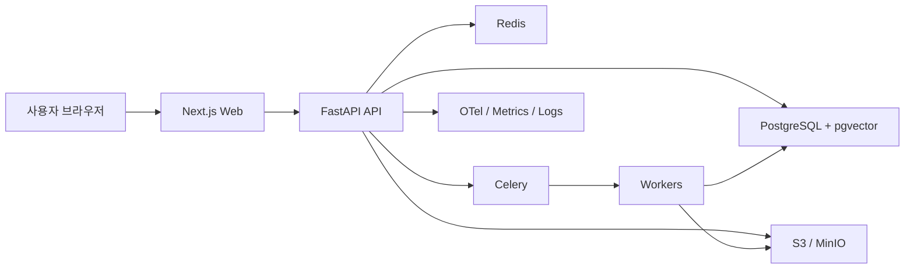

# ADR-001: RockASK 기술 스택 확정

- 상태: Accepted
- 결정일: 2026-03-11
- 대상 범위: RockASK MVP 및 Phase 1
- 관련 문서:
  - [RockASK_Dashboard_PRD.md](/D:/myhome/JJ-RAG-Platform/RockASK_Dashboard_PRD.md)
  - [schema.sql](/D:/myhome/JJ-RAG-Platform/db/schema.sql)
  - [ERD.md](/D:/myhome/JJ-RAG-Platform/db/ERD.md)

## 1. 배경

RockASK는 사내 문서, 규정, 기술 문서, 회의록, 운영 절차를 대상으로 하는 내부 RAG 기반 지식 검색 시스템이다. 이 시스템은 일반적인 챗 UI보다 아래 제약이 더 중요하다.

- 문서 권한과 조직 ACL을 검색 단계에서 안전하게 반영해야 한다.
- 답변에 출처, 버전, 최신성 정보를 제공해야 한다.
- 문서 업로드, 외부 시스템 동기화, OCR, 청킹, 임베딩, 색인을 비동기로 처리해야 한다.
- 첫 화면 대시보드, 최근 채팅, 추천 프롬프트, 주요 지식 공간, 운영 상태를 함께 제공해야 한다.
- 내부 서비스이므로 SEO보다 인증, 권한, 검색 품질, 운영 안정성이 더 중요하다.
- 초기에는 빠르게 구축하되, 문서량 증가 시 검색 성능을 확장할 수 있어야 한다.

이 ADR은 위 요구사항을 만족하기 위한 기술 스택을 프로젝트의 기준안으로 확정한다.

## 2. 의사결정 기준

기술 선택 시 아래 기준을 우선한다.

1. 사내 RAG/문서 검색 시스템에 적합한 권한 모델을 구현하기 쉬워야 한다.
2. Python 기반 AI/RAG 생태계와 자연스럽게 연결되어야 한다.
3. 대시보드, 업로드, 최근 채팅, 피드백, 운영 모니터링까지 하나의 제품으로 확장 가능해야 한다.
4. 초기 운영 복잡도는 낮추고, 필요 시 검색 인프라를 단계적으로 확장할 수 있어야 한다.
5. 타입 안정성, 테스트 용이성, 코드 유지보수성이 확보되어야 한다.
6. 모노레포 또는 유사한 단일 저장소 구조에서 프론트/백엔드를 함께 관리하기 쉬워야 한다.

## 3. 확정 결정

### 3.1 프론트엔드

RockASK 웹 애플리케이션의 기본 프론트엔드 스택은 아래로 확정한다.

- `Next.js 16`
- `React 19.2`
- `TypeScript 5.9`
- `Tailwind CSS 4.x`
- `TanStack Query`
- `pnpm`
- `Biome`

### 3.2 백엔드 API

RockASK 도메인 API와 RAG 오케스트레이션 계층의 기본 백엔드 스택은 아래로 확정한다.

- `Python 3.13.x`
- `FastAPI 0.126+`
- `Uvicorn`
- `Pydantic 2.11+`
- `SQLAlchemy 2.0`
- `Alembic`
- `uv`

### 3.3 데이터 저장소 및 검색

기본 데이터 저장소 및 검색 스택은 아래로 확정한다.

- `PostgreSQL 18`
- `pgvector 0.8.x`
- `PostgreSQL Full-Text Search`
- `pg_trgm`
- `Redis 8`
- `S3 호환 오브젝트 스토리지` 또는 `MinIO`

### 3.4 비동기 처리 및 운영

- `Celery 5.6`
- `Redis`를 초기 브로커로 사용
- `OpenTelemetry`
- `Prometheus`
- `Grafana`
- `Loki`

### 3.5 인증 및 권한

- 사내 `OIDC/OAuth2` 기반 SSO를 사용한다.
- 애플리케이션 권한 모델은 DB 기반 `ACL + 팀/역할 매핑`으로 구현한다.
- ACL은 검색 후처리가 아니라 검색 쿼리 단계에서 적용한다.

## 4. 최종 아키텍처 결정

이 구조에서 웹은 화면 렌더링과 사용자 인터랙션을 담당하고, 도메인 로직과 검색/수집/색인/권한 처리는 FastAPI가 담당한다.

## 5. 세부 결정과 이유

### 5.1 Next.js를 선택한 이유

- 내부 업무 시스템이어도 인증, 레이아웃, 라우팅, 서버 컴포넌트 활용이 유리하다.
- 대시보드 초기 데이터 로딩을 서버 중심으로 설계하기 쉽다.
- 첫 화면처럼 요약 카드와 권한 기반 UI를 안정적으로 SSR/하이브리드 렌더링할 수 있다.
- 이후 관리 화면, 업로드 화면, 채팅 화면, 알림 페이지까지 확장하기 좋다.

### 5.2 React 19 + TypeScript 5.9를 선택한 이유

- 대규모 화면 상태보다 데이터 중심 UI가 많아 React 생태계가 충분히 적합하다.
- TypeScript는 API 계약, 컴포넌트 props, DTO 타입 관리에 필수적이다.
- 질의/출처/피드백/권한 UI는 데이터 구조가 복잡하므로 정적 타입 안전성이 필요하다.

### 5.3 Tailwind CSS를 선택한 이유

- 현재 시안이 유틸리티 기반 스타일링에 잘 맞는다.
- 대시보드, 카드, 배지, 상태 UI를 빠르게 구현하기 쉽다.
- 디자인 시스템 전환 전까지 생산성이 높다.

### 5.4 FastAPI를 선택한 이유

- RAG, 임베딩, 파서, OCR, 벡터 검색 등 Python 중심 생태계와 가장 자연스럽게 연결된다.
- 요청/응답 모델 검증을 Pydantic으로 표준화하기 쉽다.
- 비동기 API와 백그라운드 작업 연계가 단순하다.
- OpenAPI 문서 자동 생성으로 프론트엔드 협업 비용이 낮다.

### 5.5 PostgreSQL + pgvector를 초기 검색 저장소로 선택한 이유

- 메타데이터, 권한, 채팅, 피드백, 운영 로그를 한 DB에서 다룰 수 있다.
- `pgvector`로 벡터 검색을, `FTS + pg_trgm`으로 키워드/부분일치 검색을 동시에 처리할 수 있다.
- 초기 단계에서 별도 검색 클러스터를 두지 않아도 되어 운영 복잡도가 낮다.
- ACL 조건과 검색 결과를 같은 질의 계층에서 제어하기 쉽다.

### 5.6 Redis + Celery를 선택한 이유

- 문서 업로드, OCR, 청킹, 임베딩, 색인은 동기 HTTP 요청으로 처리하면 안 된다.
- Celery는 Python 워커 생태계와 검증된 조합이고, 초기 구현 비용이 낮다.
- Redis는 브로커와 캐시를 함께 처리할 수 있어 MVP에 적합하다.

### 5.7 S3 호환 스토리지를 선택한 이유

- 원본 문서, 파생 파일, OCR 결과물, 썸네일을 안정적으로 저장하기 좋다.
- 클라우드와 온프레미스 양쪽에 대응하기 쉽다.
- 내부망 환경에서는 MinIO 같은 대체 구현을 사용할 수 있다.

## 6. 이번 결정에서 제외한 대안

### 대안 A: `Vite + React SPA`

검토 결과:
- 장점: 단순하고 빠르며 초기 개발 속도가 높다.
- 단점: 인증 후 권한 기반 초기 화면 구성, 서버 중심 데이터 프리패치, 제품 확장성 측면에서 Next.js 대비 이점이 작다.

결론:
- 단일 화면 SPA에는 적합하지만, RockASK는 대시보드/검색/업로드/관리 기능이 함께 가므로 채택하지 않는다.

### 대안 B: `NestJS` 또는 Node.js 중심 백엔드

검토 결과:
- 장점: 프론트와 언어 통일이 가능하다.
- 단점: RAG, 파싱, OCR, 임베딩, 검색 파이프라인에서 Python 생태계 이점을 잃는다.

결론:
- AI/RAG 도메인 생산성과 생태계 적합성을 우선해 채택하지 않는다.

### 대안 C: `Django` 기반 백엔드

검토 결과:
- 장점: 관리자 화면과 ORM은 강하다.
- 단점: API 중심 설계와 RAG 서비스 분리 관점에서는 FastAPI가 더 단순하다.

결론:
- 관리자 콘솔보다 API/작업 파이프라인이 핵심이므로 채택하지 않는다.

### 대안 D: `OpenSearch`를 초기부터 도입

검토 결과:
- 장점: 대규모 텍스트 검색과 분석에 강하다.
- 단점: 운영 복잡도, 인프라 비용, 동기화 설계 비용이 커진다.

결론:
- 초기에는 `PostgreSQL FTS + pgvector`로 시작하고, 문서량과 검색 부하가 커질 때 추가 도입한다.

### 대안 E: 전용 프레임워크/오케스트레이터 중심 RAG 스택을 핵심 의존성으로 채택

검토 결과:
- 장점: 초기 실험 속도가 빠를 수 있다.
- 단점: 제품화 단계에서 추상화 누수, 버전 변화, 디버깅 비용이 커질 수 있다.

결론:
- 핵심 도메인은 애플리케이션이 직접 통제하고, 필요 시 라이브러리는 부분적으로만 사용한다.

## 7. 확정 스택 요약표

| 영역 | 확정 스택 |
|---|---|
| Frontend | `Next.js 16`, `React 19.2`, `TypeScript 5.9`, `Tailwind CSS 4.x`, `TanStack Query`, `Biome`, `pnpm` |
| Backend API | `Python 3.13.x`, `FastAPI`, `Pydantic 2`, `SQLAlchemy 2`, `Alembic`, `Uvicorn`, `uv` |
| DB | `PostgreSQL 18` |
| Vector Search | `pgvector 0.8.x` |
| Keyword Search | `PostgreSQL FTS`, `pg_trgm` |
| Cache/Broker | `Redis 8` |
| Async Jobs | `Celery 5.6` |
| Object Storage | `S3 호환 스토리지` 또는 `MinIO` |
| Observability | `OpenTelemetry`, `Prometheus`, `Grafana`, `Loki` |
| Auth | 사내 `OIDC/OAuth2` SSO |

## 8. 예상되는 결과와 영향

### 긍정적 영향

- RAG/검색 파이프라인을 Python 중심으로 빠르게 구축할 수 있다.
- 초기 운영 복잡도를 낮추면서도 검색 품질과 권한 모델을 함께 설계할 수 있다.
- 대시보드, 채팅, 업로드, 운영 화면을 하나의 웹 제품으로 일관되게 확장할 수 있다.
- 검색 결과와 ACL, 출처, 문서 버전 정보를 하나의 데이터 계층에서 관리하기 쉽다.

### 부정적 영향

- 프론트와 백엔드 언어가 분리되므로 팀이 TS와 Python 모두 다뤄야 한다.
- PostgreSQL 중심 검색은 초대형 검색 워크로드에서 한계가 있을 수 있다.
- Celery/Redis 운영과 워커 모니터링을 별도로 관리해야 한다.

### 감수하는 트레이드오프

- 초기 단순성과 AI 생태계 적합성을 위해 언어 통일성을 포기한다.
- 초기 운영 단순성을 위해 OpenSearch 도입을 지연한다.
- SSR/제품 확장성을 위해 순수 SPA보다 Next.js 복잡성을 받아들인다.

## 9. 구현 원칙

- 검색은 `FTS + vector` 하이브리드로 시작한다.
- ACL은 검색 결과 후처리가 아니라 검색 쿼리 단계에서 적용한다.
- 모든 답변은 citation 저장 구조를 가져야 한다.
- 업로드/동기화/색인은 반드시 비동기 워커로 처리한다.
- KPI와 운영 상태는 온라인 트랜잭션 테이블과 분리된 집계 방식으로 제공한다.
- 임베딩 차원 변경 시 `document_embeddings`와 `query_runs.query_embedding`을 동시에 변경한다.

## 10. 재검토 조건

아래 조건이 발생하면 이 ADR을 다시 검토한다.

- 검색 대상 청크 수가 수천만 단위를 넘어 PostgreSQL 검색 성능이 급격히 저하되는 경우
- 다중 지역 또는 다중 데이터센터 배포가 필요한 경우
- 실시간 이벤트 기반 파이프라인이 필요해 Celery 구조가 한계에 도달하는 경우
- 대시보드 외 별도 공개 웹 채널이 생겨 SEO/엣지 렌더링 요구가 크게 달라지는 경우
- 임베딩 모델 또는 검색 전략 변경으로 벡터 저장 구조를 다시 설계해야 하는 경우

## 11. 후속 실행 항목

- `schema.sql`을 기준으로 Alembic 마이그레이션 초기본 생성
- FastAPI 프로젝트 골격 생성
- Next.js App Router 기반 웹 프로젝트 초기화
- 공통 API 계약서와 DTO 정의
- 검색/수집/피드백 MVP 범위에 대한 티켓 분해

## 12. 승인 메모

이 ADR은 현재 RockASK MVP와 Phase 1에 대한 기준 결정이다.  
향후 특정 모듈에서 별도 스택 변경이 필요할 경우, 본 ADR을 직접 수정하지 말고 후속 ADR로 추가 결정한다.
