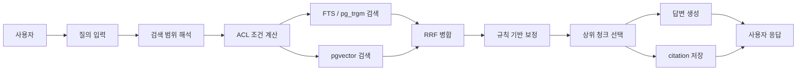

# ADR-002: RockASK 검색 아키텍처 확정

- 상태: Accepted
- 결정일: 2026-03-11
- 대상 범위: RockASK MVP 및 Phase 1
- 관련 문서:
  - [ADR-001-tech-stack.md](/D:/myhome/JJ-RAG-Platform/docs/adr/ADR-001-tech-stack.md)
  - [RockASK_Dashboard_PRD.md](/D:/myhome/JJ-RAG-Platform/RockASK_Dashboard_PRD.md)
  - [schema.sql](/D:/myhome/JJ-RAG-Platform/db/schema.sql)
  - [ERD.md](/D:/myhome/JJ-RAG-Platform/db/ERD.md)

## 1. 배경

RockASK는 사내 문서, 규정, 기술 문서, 회의록, 운영 절차를 대상으로 하는 내부 RAG 기반 검색 시스템이다. 검색 아키텍처는 단순한 벡터 검색이 아니라 아래 요구를 동시에 충족해야 한다.

- 조직/팀/역할/개별 문서 권한을 검색 단계에서 안전하게 반영해야 한다.
- 답변은 항상 출처와 문서 버전, 최신성 정보를 제공해야 한다.
- 정책 문서, 기술 문서, 운영 절차, 회의록처럼 검색 패턴이 서로 다른 문서를 함께 다뤄야 한다.
- 한글 중심 문서에서 제목 일치, 부분 문자열, 용어 변형, 약어 검색까지 대응해야 한다.
- 초기 운영 단계에서는 별도 검색 클러스터 없이도 안정적으로 운영되어야 한다.
- 문서량이 증가하면 향후 별도 검색 엔진이나 reranker를 확장할 수 있어야 한다.

이 ADR은 RockASK의 검색 아키텍처를 제품의 기준안으로 확정한다.

## 2. 의사결정 기준

1. 검색 단계에서 ACL을 안전하게 적용할 수 있어야 한다.
2. 키워드 검색과 의미 검색을 함께 지원해야 한다.
3. 초기 운영 복잡도와 비용을 낮춰야 한다.
4. 출처 추적과 디버깅이 쉬워야 한다.
5. 질의 성능과 검색 품질을 단계적으로 개선할 수 있어야 한다.
6. PostgreSQL 기반 업무 데이터와 검색 데이터를 자연스럽게 연동할 수 있어야 한다.

## 3. 확정 결정

### 3.1 기본 검색 전략

RockASK의 기본 검색 전략은 `PostgreSQL Full-Text Search + pgvector + pg_trgm` 기반 하이브리드 검색으로 확정한다.

- 키워드 검색: `document_chunks.search_vector` 기반 FTS
- 부분 일치 및 제목 보강: `pg_trgm`
- 의미 검색: `document_embeddings.embedding`
- 검색 단위: `문서`가 아니라 `청크(chunk)`
- 검색 병합 방식: `RRF(Reciprocal Rank Fusion)` 기반 랭킹 통합

### 3.2 초기 검색 저장소 결정

초기 검색 저장소는 별도 검색 엔진을 사용하지 않고 `PostgreSQL 18 + pgvector`로 확정한다.

- OpenSearch는 초기 도입 대상이 아니다.
- 전용 벡터 DB도 초기 도입 대상이 아니다.
- 모든 검색 메타데이터와 권한 조건은 PostgreSQL 중심으로 유지한다.

### 3.3 질의 실행 파이프라인

질의 실행 파이프라인은 아래 순서로 확정한다.

1. 사용자 질의 수신
2. 검색 범위(`search_scopes`) 해석
3. 사용자/팀/역할 ACL 해석
4. 키워드 후보 검색
5. 벡터 후보 검색
6. 후보 병합(RRF)
7. 규칙 기반 보정
8. 상위 청크 선택
9. 답변 생성
10. citation 저장 및 응답 반환

### 3.4 ACL 적용 방식

ACL은 검색 결과를 가져온 뒤 필터링하지 않고, 검색 쿼리 단계에서 적용하는 것으로 확정한다.

- 검색 후보군 자체가 권한 범위 내 데이터로만 구성되어야 한다.
- 권한이 없는 문서는 검색 점수 계산 대상에도 포함하지 않는다.
- `search_scopes`와 `acl_entries`를 동시에 적용한다.

### 3.5 답변과 citation 정책

모든 RAG 응답은 citation을 포함하는 구조로 확정한다.

- citation은 `document`, `document_version`, `document_chunk`까지 추적 가능해야 한다.
- 답변과 citation 관계는 `messages`와 `citations` 테이블에 저장한다.
- 화면에는 최소한 문서명, 버전, 페이지 또는 구간, 최신성 정보가 노출되어야 한다.

### 3.6 rerank 정책

초기 MVP의 rerank는 경량 정책으로 시작한다.

- 1단계: RRF 기반 후보 병합
- 2단계: 제목 일치, 최근성, 검색 범위 적합성, 문서 상태를 반영한 규칙 기반 보정
- Phase 2 이후 필요 시 cross-encoder 또는 LLM reranker를 추가 검토한다.

### 3.7 검색 실패 원칙

- 검색이 실패해도 사용자 메시지와 오류 원인은 `query_runs`에 기록한다.
- 답변을 생성하지 못하면 빈 citation 응답이 아니라 실패 상태를 명시한다.
- 부분 검색 성공 시에도 citation 없는 생성 응답은 허용하지 않는다.

## 4. 최종 아키텍처 결정

## 5. 세부 결정과 이유

### 5.1 청크 단위 검색을 선택한 이유

- 문서 전체 단위 검색은 긴 규정집, 회의록, 기술 문서에서 정확도가 떨어진다.
- citation을 제공하려면 근거가 되는 텍스트 단위를 좁혀야 한다.
- 청크 단위는 벡터 검색과 FTS 결합에 적합하다.

### 5.2 하이브리드 검색을 선택한 이유

- 정책/규정 문서는 키워드와 정확한 용어 일치가 중요하다.
- 자연어 질의나 의미 기반 탐색은 벡터 검색이 유리하다.
- 한 방식만으로는 사내 문서 탐색 품질을 안정적으로 보장하기 어렵다.

### 5.3 PostgreSQL 중심 검색을 선택한 이유

- 문서, 버전, 권한, 채팅, 피드백, 운영 메타데이터가 모두 PostgreSQL에 있다.
- 초기 단계에서 별도 검색 인프라를 도입하지 않아 운영 복잡도가 낮다.
- ACL 필터를 검색 조건에 바로 반영하기 쉽다.

### 5.4 RRF를 선택한 이유

- 키워드 점수와 벡터 점수를 직접 정규화해 합치는 방식보다 안정적이다.
- 시스템 변경 시 점수 체계가 달라도 병합 로직이 덜 흔들린다.
- 디버깅이 상대적으로 단순하다.

### 5.5 query-time ACL을 선택한 이유

- 후처리 ACL은 검색 후보군에 민감 문서가 포함될 가능성을 만든다.
- 점수와 citation이 권한 없는 문서의 영향을 받을 수 있다.
- 사내 RAG에서 가장 위험한 실패는 품질 저하보다 권한 누수다.

### 5.6 citation 강제 정책을 선택한 이유

- 내부 지식 검색은 “왜 이 답이 나왔는가”가 중요하다.
- 운영 문서와 규정은 최신 버전 확인이 필요하다.
- 피드백과 품질 개선의 기준점이 citation이다.

## 6. 이번 결정에서 제외한 대안

### 대안 A: OpenSearch를 초기부터 도입

검토 결과:
- 장점: 대규모 텍스트 검색과 분석 기능에 강하다.
- 단점: 운영 비용, 색인 동기화, ACL 설계가 초기부터 복잡해진다.

결론:
- 초기에는 도입하지 않는다. PostgreSQL 검색 한계가 확인될 때 후속 ADR로 도입 여부를 검토한다.

### 대안 B: 전용 벡터 DB를 초기부터 도입

검토 결과:
- 장점: 의미 검색 전용 성능 최적화가 가능하다.
- 단점: 메타데이터 조인과 ACL 적용이 복잡해진다.

결론:
- 초기에는 도입하지 않는다. PostgreSQL + pgvector로 시작한다.

### 대안 C: 벡터 검색만 사용

검토 결과:
- 장점: 자연어 질문 대응은 쉽다.
- 단점: 정확한 용어, 문서 제목, 조항 번호, 부분 문자열 검색에 약하다.

결론:
- 채택하지 않는다.

### 대안 D: 키워드 검색만 사용

검토 결과:
- 장점: 설명 가능성과 운영 단순성이 높다.
- 단점: 의미 기반 검색과 자연어 질문 품질이 부족하다.

결론:
- 채택하지 않는다.

### 대안 E: 검색 후 결과 필터링 방식의 ACL

검토 결과:
- 장점: 구현이 쉬워 보인다.
- 단점: 보안상 위험하고 랭킹이 왜곡된다.

결론:
- 절대 채택하지 않는다.

## 7. 확정 아키텍처 요약표

| 영역 | 결정 |
|---|---|
| 검색 단위 | `document_chunks` |
| 키워드 검색 | `PostgreSQL FTS` |
| 부분 문자열/제목 보강 | `pg_trgm` |
| 의미 검색 | `pgvector` |
| 병합 방식 | `RRF` |
| 권한 적용 시점 | 검색 쿼리 단계 |
| 기본 citation 정책 | 항상 저장, 항상 표시 |
| 기본 검색 저장소 | `PostgreSQL` |
| 초기 전용 검색 엔진 | 도입하지 않음 |
| 초기 전용 벡터 DB | 도입하지 않음 |

## 8. 예상되는 결과와 영향

### 긍정적 영향

- 검색 품질과 운영 복잡도 사이에서 초기 균형이 좋다.
- ACL과 citation을 강하게 통제할 수 있다.
- 디버깅 시 어떤 청크가 어떤 점수로 선택되었는지 추적하기 쉽다.
- PRD의 첫 화면 기능과 바로 연결할 수 있다.

### 부정적 영향

- PostgreSQL 하나에 검색 부하가 함께 실린다.
- OpenSearch나 전용 벡터 DB보다 초대형 워크로드 확장성은 낮다.
- RRF와 규칙 기반 보정만으로는 장기적으로 정교한 랭킹에 한계가 있을 수 있다.

### 감수하는 트레이드오프

- 초기 운영 단순성을 위해 분산 검색 엔진을 미룬다.
- 품질 고도화 속도보다 권한 안전성과 설명 가능성을 우선한다.

## 9. 구현 원칙

- `documents.current_version_id`에 연결된 활성 버전만 기본 검색 대상으로 삼는다.
- `document_chunks`는 색인 완료 상태의 버전에 한해 검색 가능해야 한다.
- `query_runs`에는 질의 범위, 검색 상태, 후보 수, 점수, 지연 시간을 저장한다.
- `citations`는 답변 메시지 단위로 저장한다.
- 검색 범위는 `search_scopes`와 `acl_entries`를 함께 반영해 계산한다.
- 검색 결과가 충분하지 않으면 답변 생성보다 “근거 부족”을 우선 반환한다.

## 10. 재검토 조건

아래 조건이 발생하면 이 ADR을 다시 검토한다.

- 검색 대상 청크 수가 수천만 단위를 넘어 PostgreSQL 검색 지연이 허용 범위를 넘는 경우
- 부서별/지역별 샤딩 또는 별도 검색 클러스터가 필요한 경우
- cross-encoder reranker가 필수 수준으로 요구되는 경우
- citation 저장 비용이 지나치게 커지는 경우
- 검색 품질 목표가 현 방식으로 달성되지 않는 경우

## 11. 후속 실행 항목

- `retrieval-service` 인터페이스 정의
- RRF 병합 로직과 규칙 기반 보정 정책 명세화
- `query_runs`, `citations` 저장 규약 정의
- 검색 성능 KPI와 품질 평가 기준 정의
- OpenSearch 도입 기준선을 수치화한 운영 문서 작성

## 12. 승인 메모

이 ADR은 RockASK의 검색 아키텍처 기준안을 정의한다.  
향후 OpenSearch, 별도 벡터 DB, 고급 reranker를 도입할 경우 본 문서를 수정하지 말고 후속 ADR로 결정한다.
