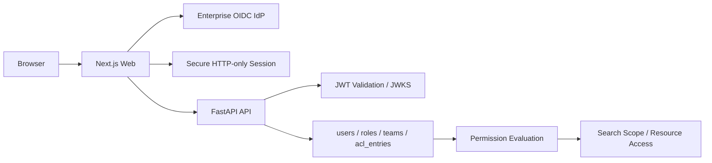

# ADR-003: RockASK 인증 및 권한 모델 확정

- 상태: Accepted
- 결정일: 2026-03-11
- 대상 범위: RockASK MVP 및 Phase 1
- 관련 문서:
  - [ADR-001-tech-stack.md](/D:/myhome/JJ-RAG-Platform/docs/adr/ADR-001-tech-stack.md)
  - [ADR-002-search-architecture.md](/D:/myhome/JJ-RAG-Platform/docs/adr/ADR-002-search-architecture.md)
  - [RockASK_Dashboard_PRD.md](/D:/myhome/JJ-RAG-Platform/RockASK_Dashboard_PRD.md)
  - [schema.sql](/D:/myhome/JJ-RAG-Platform/db/schema.sql)
  - [ERD.md](/D:/myhome/JJ-RAG-Platform/db/ERD.md)

## 1. 배경

RockASK는 사내 문서를 권한 범위 안에서 검색하고, 답변에 citation을 제공하는 내부 지식 검색 시스템이다. 따라서 인증과 권한 모델은 일반 웹 앱보다 더 강하게 설계되어야 한다.

- 사용자는 사내 계정으로 로그인해야 한다.
- 팀, 역할, 문서 ACL에 따라 접근 가능한 지식 범위가 달라진다.
- 권한이 없는 문서는 검색 후보군에도 포함되면 안 된다.
- 대시보드, 추천 프롬프트, 최근 업데이트, 최근 채팅도 모두 사용자 권한에 맞춰 노출되어야 한다.
- 관리자 기능과 일반 사용자 기능은 명확히 분리되어야 한다.
- 문서 접근과 권한 변경은 감사 가능해야 한다.

이 ADR은 RockASK의 인증(Authentication)과 권한(Authorization) 모델을 기준안으로 확정한다.

## 2. 의사결정 기준

1. 사내 SSO와 자연스럽게 연동되어야 한다.
2. 사용자, 팀, 역할, 개별 리소스 권한을 함께 표현할 수 있어야 한다.
3. 검색 단계에서 ACL을 적용할 수 있어야 한다.
4. 프론트와 API 간 토큰 처리 방식이 보안적으로 안전해야 한다.
5. 운영 중 권한 변경, 감사를 추적하기 쉬워야 한다.
6. 조직 구조가 변경되어도 모델을 크게 바꾸지 않아야 한다.

## 3. 확정 결정

### 3.1 인증 방식

RockASK의 외부 인증은 사내 `OIDC/OAuth2` 기반 SSO로 확정한다.

- IdP 예시: Entra ID, Okta, Keycloak 등
- 사용자 인증의 원천은 애플리케이션 DB가 아니라 사내 IdP다.
- RockASK는 비밀번호를 직접 저장하거나 관리하지 않는다.

### 3.2 세션 방식

웹 세션 모델은 `Next.js 기반 서버 세션 + HTTP-only secure cookie`로 확정한다.

- 브라우저는 access token을 로컬 스토리지에 저장하지 않는다.
- 로그인 후 브라우저는 same-site 정책이 적용된 secure HTTP-only 세션 쿠키를 가진다.
- Next.js 서버 또는 Route Handler/BFF 레이어가 세션을 해석한다.
- FastAPI에는 서버 측에서 bearer token을 전달하거나 검증 가능한 사용자 컨텍스트를 전달한다.

### 3.3 API 인증 방식

FastAPI API는 `OIDC JWT 검증` 기반 bearer 인증을 기본 방식으로 확정한다.

- API는 IdP 공개키(JWKS)로 JWT를 검증한다.
- 최소 검증 항목: issuer, audience, exp, sub, signature
- 사용자 식별 키는 `sub` 또는 회사 표준 사용자 식별자와 `employee_no/email` 매핑으로 처리한다.

### 3.4 사용자 프로비저닝

사용자 프로비저닝은 `JIT(Just-In-Time) 생성 + 주기적 동기화` 조합으로 확정한다.

- 첫 로그인 시 `users` 테이블에 사용자를 생성 또는 갱신한다.
- 팀/역할/표시명 같은 속성은 로그인 시점에 동기화한다.
- 대규모 조직 변경 반영을 위해 별도 주기 동기화를 허용한다.

### 3.5 권한 모델

권한 모델은 `RBAC + 팀 소속 + 리소스 ACL`의 혼합 모델로 확정한다.

- `RBAC`: 관리자/운영자/일반 사용자 같은 거친 권한 제어
- `팀 소속`: 부서별 기본 접근 범위와 검색 범위 제어
- `ACL`: 지식 공간, 문서, 봇 단위의 세밀한 예외 제어

### 3.6 권한 적용 계층

권한은 아래 계층에서 동시에 적용한다.

1. UI 노출 제어
2. API 접근 제어
3. 검색 범위 계산
4. 검색 쿼리 실행
5. citation 노출 제어

권한 적용의 최종 기준은 항상 API와 검색 계층이다. UI에서 숨겼다는 이유만으로 접근이 허용되어서는 안 된다.

### 3.7 권한 저장 방식

권한 저장 기준은 아래와 같이 확정한다.

- 조직 구조: `teams`
- 사용자 기본 정보: `users`
- 역할: `roles`, `user_roles`
- 리소스별 예외 권한: `acl_entries`
- 검색 범위: `search_scopes`

`acl_entries`는 다형 구조를 사용한다.

- `resource_type`: `knowledge_space`, `document`, `document_version`, `assistant` 등
- `resource_id`: 각 리소스의 UUID
- `subject_type`: `user`, `team`, `role`
- `subject_id`: 주체 UUID
- `permission`: `view`, `ask`, `upload`, `manage`, `admin`

### 3.8 검색 권한 원칙

- 검색 결과 후처리 ACL은 허용하지 않는다.
- 검색 가능한 범위는 `search_scopes + acl_entries + user/team/role` 조합으로 계산한다.
- 권한이 없는 문서는 결과 목록, citation, 최근 업데이트, 주요 지식 공간 모두에서 제외한다.

### 3.9 감사 및 추적

인증과 권한 관련 주요 이벤트는 모두 감사 로그에 남긴다.

- 로그인 성공/실패
- 토큰 검증 실패
- 권한 변경
- 관리자 설정 변경
- 문서 접근
- 지식 공간 접근
- 민감 리소스 조회

감사 로그는 `audit_logs`에 저장한다.

## 4. 최종 아키텍처 결정

## 5. 세부 결정과 이유

### 5.1 OIDC SSO를 선택한 이유

- 사내 계정 정책과 MFA, 계정 잠금, 퇴사 처리 등을 IdP가 일관되게 관리할 수 있다.
- 애플리케이션이 비밀번호 저장 책임을 지지 않는다.
- 내부 서비스 표준과 맞추기 쉽다.

### 5.2 서버 세션 + HTTP-only 쿠키를 선택한 이유

- 브라우저 로컬 스토리지에 access token을 보관하는 방식보다 안전하다.
- XSS가 발생해도 토큰 탈취 위험을 줄일 수 있다.
- Next.js 서버 중심 렌더링과 잘 맞는다.

### 5.3 혼합 권한 모델을 선택한 이유

- RBAC만으로는 “특정 문서만 특정 팀 공개” 같은 요구를 표현하기 어렵다.
- ACL만으로 모든 권한을 관리하면 운영 비용이 너무 크다.
- 팀 소속은 내부 문서 접근 범위를 결정하는 핵심 기준이다.
- 따라서 역할, 팀, 예외 ACL을 함께 써야 실제 조직 구조를 반영할 수 있다.

### 5.4 query-time 권한 평가를 선택한 이유

- 검색 후 필터는 보안상 취약하다.
- 검색 점수와 citation이 권한 없는 문서 영향을 받으면 안 된다.
- 지식 검색 시스템에서는 “보이지 않아야 할 결과가 랭킹에 관여하지 않는 것”이 중요하다.

### 5.5 JIT 프로비저닝을 선택한 이유

- 초기 사용자 도입 속도가 빠르다.
- 별도의 수동 계정 개설 절차 없이 바로 사용할 수 있다.
- 필요한 경우 주기 동기화로 조직 변경을 보완할 수 있다.

## 6. 이번 결정에서 제외한 대안

### 대안 A: 앱 내부 계정/비밀번호 인증

검토 결과:
- 장점: 구현은 단순해 보인다.
- 단점: 보안 정책, MFA, 계정 수명주기 관리가 모두 애플리케이션 책임이 된다.

결론:
- 채택하지 않는다.

### 대안 B: 순수 RBAC 모델

검토 결과:
- 장점: 운영과 구현이 단순하다.
- 단점: 문서/지식공간 단위 예외 권한을 표현하기 어렵다.

결론:
- 채택하지 않는다.

### 대안 C: 외부 그룹만으로 모든 권한 처리

검토 결과:
- 장점: 중앙 IdP에서 일괄 관리 가능하다.
- 단점: 문서 단위 예외와 앱 내부 운영 권한을 세밀하게 다루기 어렵다.

결론:
- 채택하지 않는다.

### 대안 D: PostgreSQL RLS(Row-Level Security) 중심 모델

검토 결과:
- 장점: DB 차원 보안 강화를 기대할 수 있다.
- 단점: 다형 ACL, 검색 쿼리, 워커 처리, 서비스 간 컨텍스트 전파가 복잡해진다.

결론:
- 초기에는 채택하지 않는다. 애플리케이션 계층에서 권한 평가를 수행한다.

### 대안 E: 브라우저가 API 토큰을 직접 저장/전달하는 SPA 모델

검토 결과:
- 장점: 단순한 클라이언트 구현이 가능하다.
- 단점: 토큰 노출 위험이 커지고 서버 중심 렌더링과도 맞지 않는다.

결론:
- 채택하지 않는다.

## 7. 확정 모델 요약표

| 영역 | 결정 |
|---|---|
| 인증 | 사내 `OIDC/OAuth2` SSO |
| 웹 세션 | `HTTP-only secure cookie` 기반 서버 세션 |
| API 인증 | `JWT bearer` 검증 |
| 사용자 생성 | `JIT + 주기 동기화` |
| 권한 모델 | `RBAC + 팀 소속 + ACL` |
| 권한 적용 시점 | UI, API, 검색 범위, 검색 쿼리, citation |
| 토큰 저장 | 브라우저 로컬 스토리지 미사용 |
| 감사 로그 | `audit_logs` 필수 기록 |

## 8. 예상되는 결과와 영향

### 긍정적 영향

- 사내 계정 체계와 보안 정책에 자연스럽게 맞는다.
- 문서 예외 권한과 팀 기반 기본 권한을 동시에 다룰 수 있다.
- 검색 시스템 특성상 중요한 권한 누수 위험을 줄일 수 있다.
- 대시보드와 검색, 업로드, 운영 기능에 동일한 권한 모델을 적용할 수 있다.

### 부정적 영향

- 권한 계산 로직이 단순 RBAC보다 복잡하다.
- 앱 내부 ACL 운영 정책과 툴링이 필요하다.
- IdP 클레임과 내부 사용자 모델 간 매핑을 유지해야 한다.

### 감수하는 트레이드오프

- 구현 단순성보다 보안성과 조직 적합성을 우선한다.
- DB RLS의 일관성 대신 애플리케이션 계층의 명시적 권한 평가를 선택한다.

## 9. 구현 원칙

- API는 항상 인증된 사용자 컨텍스트를 요구한다.
- `users`, `teams`, `roles`, `user_roles`, `acl_entries`는 권한 평가의 단일 진실 공급원으로 취급한다.
- 민감 문서 접근은 감사 로그를 반드시 남긴다.
- `search_scopes`는 사용자 권한에 따라 동적으로 계산/노출한다.
- 관리자 전용 액션은 UI 숨김이 아니라 API 권한 검사로 차단한다.
- 사용자 비활성화 시 세션과 액세스 권한이 즉시 반영되어야 한다.

## 10. 재검토 조건

아래 조건이 발생하면 이 ADR을 다시 검토한다.

- 다중 테넌트 구조가 도입되어 권한 모델이 조직 경계를 넘어야 하는 경우
- 데이터 규제 요구로 DB 수준 강제 보안이 의무화되는 경우
- 외부 협력사/게스트 계정 모델이 추가되는 경우
- 서비스 간 직접 호출이 크게 늘어 머신 투 머신 인증이 중심이 되는 경우
- ACL 규모가 매우 커져 권한 계산 성능이 병목이 되는 경우

## 11. 후속 실행 항목

- OIDC 로그인 플로우와 세션 관리 상세 설계
- JWT 검증 미들웨어 구현
- 권한 평가 서비스 인터페이스 정의
- `acl_entries` 운영 규칙 문서화
- 관리자용 권한 관리 화면 또는 운영 툴 설계
- 감사 로그 이벤트 카탈로그 작성

## 12. 승인 메모

이 ADR은 RockASK의 인증 및 권한 모델 기준안을 정의한다.  
향후 DB RLS, 외부 파트너 접근 모델, 서비스 토큰 체계가 필요해질 경우 후속 ADR로 별도 결정한다.
