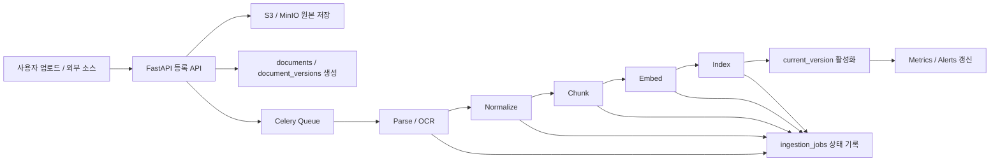

# ADR-004: RockASK 문서 수집 및 색인 파이프라인 확정

- 상태: Accepted
- 결정일: 2026-03-11
- 대상 범위: RockASK MVP 및 Phase 1
- 관련 문서:
  - [ADR-001-tech-stack.md](/D:/myhome/JJ-RAG-Platform/docs/adr/ADR-001-tech-stack.md)
  - [ADR-002-search-architecture.md](/D:/myhome/JJ-RAG-Platform/docs/adr/ADR-002-search-architecture.md)
  - [ADR-003-authz-model.md](/D:/myhome/JJ-RAG-Platform/docs/adr/ADR-003-authz-model.md)
  - [RockASK_Dashboard_PRD.md](/D:/myhome/JJ-RAG-Platform/RockASK_Dashboard_PRD.md)
  - [schema.sql](/D:/myhome/JJ-RAG-Platform/db/schema.sql)
  - [ERD.md](/D:/myhome/JJ-RAG-Platform/db/ERD.md)

## 1. 배경

RockASK는 업로드 문서뿐 아니라 외부 협업 시스템에서 동기화한 문서까지 RAG 검색 대상으로 삼는다. 문서 수집 파이프라인은 단순한 파일 저장이 아니라 아래 요건을 만족해야 한다.

- 원본 문서를 안전하게 저장해야 한다.
- 문서 버전을 추적해야 한다.
- 텍스트 추출, OCR, 청킹, 임베딩, 색인을 비동기적으로 처리해야 한다.
- 파이프라인 중 일부 단계가 실패해도 원인을 추적하고 재시도할 수 있어야 한다.
- 검색 중인 활성 버전과 새로 처리 중인 버전을 분리해야 한다.
- 수집 상태는 대시보드의 Data Health와 최근 업데이트에 반영되어야 한다.

이 ADR은 RockASK의 문서 수집 및 색인 파이프라인을 기준안으로 확정한다.

## 2. 의사결정 기준

1. 업로드와 외부 동기화를 동일한 모델로 다룰 수 있어야 한다.
2. 사용자가 검색 중인 활성 문서 버전을 안전하게 유지해야 한다.
3. 긴 처리 시간을 API 요청에서 분리해야 한다.
4. 실패 복구와 재처리가 쉬워야 한다.
5. 원본 파일, 파생 산출물, 메타데이터를 일관되게 관리해야 한다.
6. 향후 커넥터와 처리 단계를 늘릴 수 있어야 한다.

## 3. 확정 결정

### 3.1 파이프라인 실행 모델

문서 수집 및 색인 파이프라인은 `비동기 워커 기반 파이프라인`으로 확정한다.

- 사용자 업로드와 외부 동기화는 모두 비동기 작업으로 처리한다.
- API는 등록과 상태 조회만 담당한다.
- 실제 처리 단계는 Celery 워커가 수행한다.

### 3.2 논리 문서와 물리 버전 분리

문서 모델은 `documents`와 `document_versions`를 분리하는 구조로 확정한다.

- `documents`: 사용자에게 보이는 논리 문서
- `document_versions`: 실제 파일 버전, 파싱 상태, 저장 위치
- `documents.current_version_id`: 검색에 사용되는 활성 버전 포인터

이 구조는 새 버전 처리 중에도 기존 활성 버전을 서비스할 수 있게 한다.

### 3.3 원본 저장 정책

모든 원본 문서는 먼저 `S3 호환 스토리지 또는 MinIO`에 저장한 뒤 처리하는 것으로 확정한다.

- 업로드 직후 DB보다 스토리지에 원본을 먼저 고정한다.
- 스토리지 위치는 `document_versions.storage_bucket`, `storage_key`로 관리한다.
- 파생 파일도 동일한 스토리지 계층에 저장할 수 있다.

### 3.4 파이프라인 단계

표준 파이프라인 단계는 아래 순서로 확정한다.

1. 소스 등록 또는 업로드 접수
2. 원본 저장
3. 문서/버전 메타데이터 생성
4. 파싱 또는 OCR 수행
5. 텍스트 정규화
6. 청킹
7. 임베딩 생성
8. 색인 반영
9. 활성 버전 전환
10. 운영 지표 갱신

### 3.5 작업 추적 방식

파이프라인 작업 추적은 `ingestion_jobs`와 `sync_runs` 중심으로 확정한다.

- `ingestion_jobs`: 개별 문서/버전 처리 단계 추적
- `sync_runs`: 외부 커넥터 단위 동기화 실행 이력 추적
- 작업 상태는 `queued`, `running`, `succeeded`, `failed`, `retrying`, `cancelled`를 사용한다.

### 3.6 활성 버전 전환 정책

새 버전이 성공적으로 색인되기 전까지 `documents.current_version_id`는 변경하지 않는 것으로 확정한다.

- 실패한 신규 버전은 서비스 버전이 되지 않는다.
- 활성 버전 전환은 마지막 단계에서 원자적으로 수행한다.
- 검색은 항상 활성 버전에 대해서만 수행한다.

### 3.7 실패 처리 정책

- 각 단계 실패는 `ingestion_jobs.error_code`, `error_message`, `error_detail`에 기록한다.
- 재시도 가능한 실패는 자동 재시도한다.
- 반복 실패는 운영 알림과 대시보드 상태에 반영한다.
- 실패 상태가 되어도 기존 활성 버전은 계속 검색 가능해야 한다.

### 3.8 외부 소스 동기화 모델

외부 시스템 연동은 `content_sources`와 `sync_runs` 기반으로 확정한다.

- `content_sources`는 커넥터 정의와 스케줄 정보를 가진다.
- 각 동기화 시도는 `sync_runs`에 기록한다.
- 동기화 결과는 `scanned_count`, `imported_count`, `updated_count`, `failed_count`로 집계한다.

## 4. 최종 아키텍처 결정

## 5. 세부 결정과 이유

### 5.1 비동기 파이프라인을 선택한 이유

- 문서 파싱과 OCR, 임베딩은 요청-응답 시간 안에 처리할 수 없다.
- 업로드 API는 빠르게 완료되고, 상태는 별도 추적되어야 한다.
- 워커 분리를 통해 CPU 바운드/네트워크 바운드 작업을 확장하기 쉽다.

### 5.2 논리 문서와 물리 버전을 분리한 이유

- 동일 문서의 갱신 이력을 관리해야 한다.
- 실패한 새 버전 때문에 기존 검색 가능 문서가 사라지면 안 된다.
- citation에는 버전 정보가 포함되어야 한다.

### 5.3 원본 우선 저장 정책을 선택한 이유

- 파싱이 실패해도 원본을 다시 처리할 수 있다.
- 재현성과 감사 가능성이 높아진다.
- OCR, 썸네일, 파생 텍스트 같은 후처리 산출물을 안정적으로 관리할 수 있다.

### 5.4 단계별 작업 추적을 선택한 이유

- 어느 단계에서 실패했는지 정확히 파악할 수 있다.
- 운영 대시보드와 알림 시스템에 직접 연결하기 쉽다.
- 재시도와 수동 복구 정책을 세우기 쉽다.

### 5.5 활성 버전 지연 전환 정책을 선택한 이유

- 새 버전 처리 중 검색 품질이 깨지는 것을 막는다.
- 실패 시 롤백보다 “전환하지 않음”이 더 단순하고 안전하다.
- 사용자에게 안정적인 검색 경험을 제공한다.

## 6. 이번 결정에서 제외한 대안

### 대안 A: 업로드 요청에서 동기 처리

검토 결과:
- 장점: 구조가 단순해 보인다.
- 단점: 응답 지연이 길고 실패 복구가 어렵다.

결론:
- 채택하지 않는다.

### 대안 B: 버전 테이블 없이 문서 1테이블로 처리

검토 결과:
- 장점: 스키마가 단순하다.
- 단점: 버전 추적, 활성 버전 유지, 실패 복구, citation 추적이 어려워진다.

결론:
- 채택하지 않는다.

### 대안 C: 원본 없이 추출 텍스트만 저장

검토 결과:
- 장점: 저장 비용을 줄일 수 있다.
- 단점: 재처리, 감사를 수행할 수 없고 OCR/파서 변경에 대응하기 어렵다.

결론:
- 채택하지 않는다.

### 대안 D: 외부 오케스트레이터를 초기부터 도입

검토 결과:
- 장점: 복잡한 DAG 관리에 강하다.
- 단점: MVP 단계에서는 운영 복잡도와 학습 비용이 크다.

결론:
- 초기에는 Celery 기반으로 구현하고, 파이프라인 복잡도가 커지면 후속 검토한다.

### 대안 E: 신규 버전을 즉시 활성화한 뒤 색인

검토 결과:
- 장점: 구현은 단순해 보인다.
- 단점: 색인 실패 시 검색 불안정과 citation 불일치가 발생한다.

결론:
- 채택하지 않는다.

## 7. 확정 파이프라인 요약표

| 영역 | 결정 |
|---|---|
| 실행 모델 | 비동기 워커 파이프라인 |
| 큐/워커 | `Celery + Redis` |
| 원본 저장 | `S3 호환 스토리지 / MinIO` |
| 논리 문서 | `documents` |
| 물리 버전 | `document_versions` |
| 청킹 저장 | `document_chunks` |
| 임베딩 저장 | `document_embeddings` |
| 작업 추적 | `ingestion_jobs`, `sync_runs` |
| 활성 버전 전환 | 색인 성공 후 마지막 단계에서 수행 |
| 실패 복구 | 재시도 + 알림 + 기존 활성 버전 유지 |

## 8. 예상되는 결과와 영향

### 긍정적 영향

- 업로드와 동기화 모두 안정적으로 처리할 수 있다.
- 장애가 나도 검색 중인 현재 문서를 유지할 수 있다.
- 운영자가 실패 지점과 재처리 대상을 명확히 알 수 있다.
- 최근 업데이트, Data Health, 문서 상태 카드와 잘 연결된다.

### 부정적 영향

- 동기 처리보다 구조가 복잡하다.
- 워커, 큐, 스토리지 운영이 추가된다.
- 최종 검색 가능 시점이 즉시성이 아니라 파이프라인 완료 시점이 된다.

### 감수하는 트레이드오프

- 즉시성보다 안정성과 추적성을 우선한다.
- 단순한 스키마보다 버전 관리와 복구 가능성을 우선한다.

## 9. 구현 원칙

- 업로드 API는 파일 등록과 작업 생성까지만 처리한다.
- `document_versions.status`와 `ingestion_jobs.job_status`는 일관된 상태 전이 규칙을 따라야 한다.
- 새 버전이 `active`가 되기 전에는 `documents.current_version_id`를 바꾸지 않는다.
- 색인 완료 전 청크와 임베딩은 검색 후보군에 포함되지 않아야 한다.
- 커넥터 동기화는 idempotent하게 설계한다.
- 원본 checksum과 추출 텍스트 checksum을 저장해 중복 처리와 변경 감지를 지원한다.

## 10. 재검토 조건

아래 조건이 발생하면 이 ADR을 다시 검토한다.

- 처리 단계가 크게 늘어나 Celery 체인만으로 운영이 어려워지는 경우
- 외부 커넥터 수와 동기화 빈도가 급증해 별도 오케스트레이션이 필요한 경우
- OCR/파싱/임베딩 GPU 워커 분리가 필수가 되는 경우
- 버전 보존 정책과 스토리지 비용이 크게 문제되는 경우
- Near real-time 색인 요구가 강해져 이벤트 스트리밍 구조가 필요한 경우

## 11. 후속 실행 항목

- 업로드/동기화 API 명세 확정
- `ingestion_jobs` 상태 전이 표 작성
- 파서/OCR/청킹/임베딩 워커 인터페이스 정의
- 커넥터별 `content_sources.config` 구조 설계
- 최근 업데이트와 Data Health 집계 로직 정의
- 운영 재처리 도구 요구사항 정리

## 12. 승인 메모

이 ADR은 RockASK의 문서 수집 및 색인 파이프라인 기준안을 정의한다.  
향후 Temporal, Airflow, Kafka 기반 이벤트 파이프라인 등 다른 방식이 필요해질 경우 후속 ADR로 별도 결정한다.
